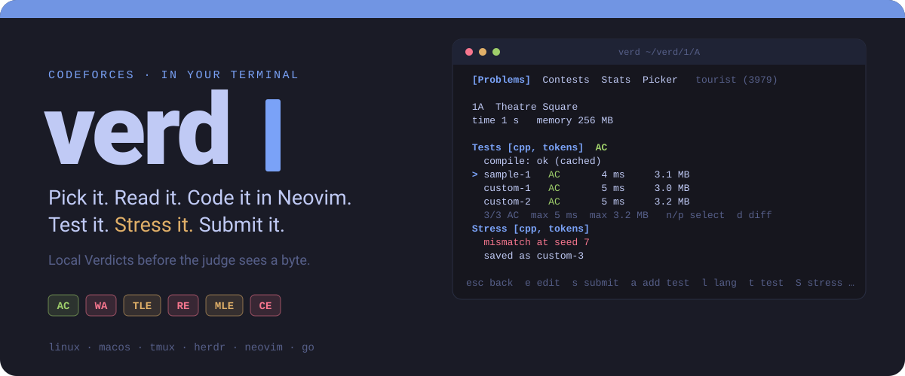
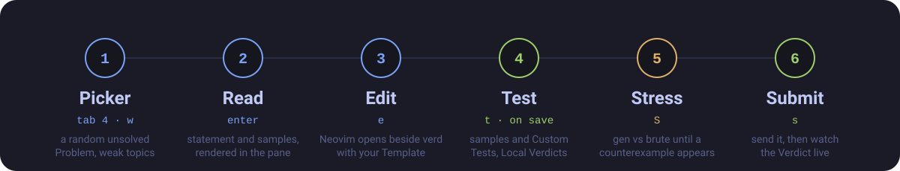
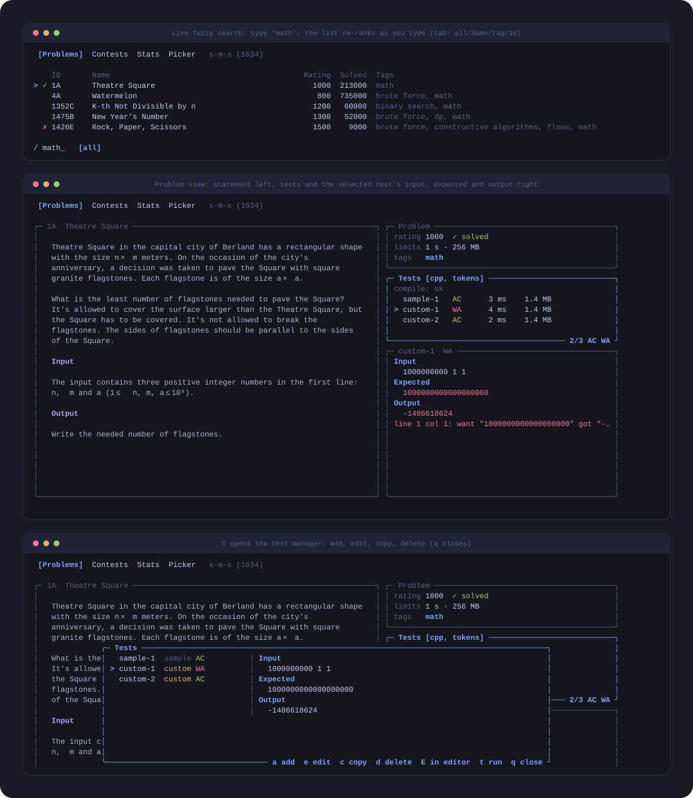

<p align="center">
  
</p>

<p align="center">
  
</p>

<p align="center">
  <a href="https://moneytosms.github.io/verd/"></a>
  <a href="https://github.com/moneytosms/verd/releases/latest"></a>
  <a href="https://github.com/moneytosms/verd/actions/workflows/pages.yml"></a>
  <a href="https://github.com/moneytosms/verd/actions/workflows/ci.yml"></a>
  
  
  <a href="./LICENSE"></a>
</p>

**verd** is a terminal companion for competitive programming: [Codeforces](https://codeforces.com) and the [CSES Problem Set](https://cses.fi/problemset/) today, more providers (USACO is next) planned. Find a Problem, read the statement, write the Solution in Neovim, run it against Sample Tests and your own, hunt for counterexamples with a stress test, submit, and watch the Verdict arrive. One keyboard-driven TUI, no browser tab for the loop.

<p align="center">
  
</p>

## Why

- **Local Verdicts first.** AC, WA, TLE, RE, MLE and CE are decided on your machine, with time and memory per test, before you spend a real submission.
- **Neovim stays Neovim.** It opens in a tmux or herdr split next to verd (or embedded in the pane, opt-in). `verd test`, `verd submit` and `verd stress` run from inside Neovim and report in verd's pane.
- **Stress testing built in.** `gen` and `brute` Templates per language; `S` finds a counterexample, shows the diff, and `w` saves it as the next Custom Test.
- **Your history, used.** Solved marks, per-topic stats, rating chart, and a Problem Picker with a weak-topics preset.
- **More than one provider.** Codeforces is on by default; turn on the [CSES Problem Set](./docs/sources.md) in Settings and browse both in one list, with a Source filter and solved marks you set by hand or pull in with `verd sync cses`. Pick your editor too: Neovim by default, or vim, helix, nano, micro, emacs, VS Code.
- **Offline-tolerant.** Everything renders from a local cache; the network refreshes it in the background.
- **Safe submit by default.** Browser handoff copies the Solution, opens the submit page and tracks the Verdict. Direct submit is opt-in and [experimental](./docs/submit.md#direct-mode).

## See it

<p align="center">
  
</p>

These are real frames rendered by verd's own model (Tokyo Night theme), not mock-ups. Eight themes ship (`terminal`, `tokyo-night`, `dracula`, `catppuccin`, `gruvbox`, `nord`, `one-dark`, `solarized`), switchable live in the Settings tab (`5`), which also edits `config.toml` for you. The mouse works: click tabs, rows, panes and settings, scroll with the wheel, click outside a modal to close it. The Problem view splits when the terminal is at least 100 columns wide; `tab` moves between its panes, and small things (help, diffs, the test manager, a Submission) open in modals you close with `q`.

## Install

**One line** (Linux and macOS, amd64 and arm64):

```sh
curl -fsSL https://raw.githubusercontent.com/moneytosms/verd/main/install.sh | sh
```

It installs the latest release to `~/.local/bin` after checking its SHA-256. Set `VERD_VERSION=v0.1.0` to pin a version or `VERD_INSTALL_DIR` to change the target, and make sure the target is on your `PATH`.

**Other ways**

```sh
go install github.com/moneytosms/verd/cmd/verd@latest   # needs Go
```

Or download a tarball from the [Releases](https://github.com/moneytosms/verd/releases) page and put `verd` on your `PATH`. Packages for the AUR (`verd-bin`) and Homebrew (`moneytosms/tap/verd`) are planned, see [#49](https://github.com/moneytosms/verd/issues/49).

Check it worked with `verd --version`. Update later with `verd update` (or re-run the installer).

You also need `nvim` for editing, a compiler or interpreter for your languages (`g++`, `gcc`, `python3` by default), and optionally `tmux` or `herdr` for the editor split.

## Quickstart (five minutes)

```sh
verd init                       # writes the config and starter Templates, then offers a guided setup
verd                            # open the TUI
verd --here                     # same, but keep Solutions in the current directory
```

1. **Pick.** On the Problems tab, `/` searches fuzzily and `f` filters by rating, status, sort and tags. `enter` opens a Problem; `4` is the Picker (`w` for your weak topics).
2. **Edit.** Press `e`. Neovim opens beside verd on `~/verd/<contest>/<index>/main.cpp`, created from your Template.
3. **Test.** Press `t` (or just save, `autotest` is on by default). Press `n`/`p` to select a test and `d` for a diff on a failing one.
4. **Manage cases.** Press `a` to add a Custom Test in place, or `T` for the test manager: edit, copy (samples too), delete.
5. **Stress.** Press `S`. The first time, verd creates `gen.cpp` and `brute.cpp` and opens them; fill them in and press `S` again. It runs until it finds a counterexample, and `w` saves it as a Custom Test.
6. **Submit.** Press `s`. The Solution is copied, the submit page opens, and the Verdict streams into the pane.

Press `?` on any screen for its key list. The complete and always-current key reference is [docs/keys.md](./docs/keys.md), which is generated from your bindings.

## Run it from Neovim

verd's TUI is the server. A `verd test`, `verd submit` or `verd stress` started from Neovim talks to the running TUI over a Unix socket and shows up in its pane; with no TUI running it runs headless and prints the result.

```lua
local function verd(cmd)
  vim.cmd("silent write")
  local out = {}
  local function collect(_, data) vim.list_extend(out, data) end
  vim.fn.jobstart({ "verd", cmd, vim.fn.expand("%:p") }, {
    stdout_buffered = true, stderr_buffered = true,
    on_stdout = collect, on_stderr = collect,
    on_exit = function(_, code)
      vim.notify(vim.trim(table.concat(out, "\n")),
        code == 0 and vim.log.levels.INFO or vim.log.levels.WARN, { title = "verd " .. cmd })
    end,
  })
end
vim.keymap.set("n", "<leader>vt", function() verd("test") end, { desc = "verd test" })
vim.keymap.set("n", "<leader>vs", function() verd("submit") end, { desc = "verd submit" })
vim.keymap.set("n", "<leader>vx", function() verd("stress") end, { desc = "verd stress" })
```

More in [docs/neovim.md](./docs/neovim.md).

## Commands

| Command | What it does |
| --- | --- |
| `verd [--here]` | Open the TUI. `--here` keeps Solutions in the current directory (`<dir>/<contest>/<index>/`) instead of the configured Workspace. |
| `verd init [--force] [--no-setup]` | Write the default config and Templates, then offer the guided setup (skipped when not in a terminal). |
| `verd setup` | Guided setup: handle, Workspace, language, theme, editor split and submit mode, written into `config.toml`. Safe to re-run. |
| `verd --help` | List the commands. |
| `verd config [path\|keys\|get <key>\|set <key> <value>]` | Print the effective config, or read and change one key. |
| `verd keys [--json]`, `verd keys set <ctx.action> <key>...` | List and rebind every shortcut. See [Customizing](./docs/customizing.md). |
| `verd themes [show <name>]` | List themes, or print an editable `[themes.*]` block. |
| `verd test <file>` | Run Sample and Custom Tests. Exit `0` only if every test is AC. |
| `verd stress [--iter N] [--time S] <file>` | Search for a counterexample. Exit `0` only if none was found. |
| `verd submit <file>` | Submit and track the Verdict. Exit `0` only on Accepted. |
| `verd update [--check]` | Replace verd with the latest release (checksum verified); `--check` only reports. |
| `verd daily` | Today's pick: an unsolved Codeforces Problem near your rating, from your weak topics when you have any. Same all day. |
| `verd sync [cses]` | Pull your solved CSES tasks into verd as marks. Asks for your CSES login the first time; the password is never stored. |
| `verd login` / `verd logout [cses]` | Save or delete the browser session used by [direct submit](./docs/submit.md#direct-mode). |
| `verd --version` | Print the version. |

Exit codes: `0` success, `1` the thing you asked about failed (WA, counterexample, rejected), `2` verd could not do it (bad input, build error, offline).

## Documentation

| Page | Covers |
| --- | --- |
| [Customizing](./docs/customizing.md) | Set up and restyle verd from the CLI: shortcuts, themes, layout. Written for people and agents. |
| [Configuration](./docs/config.md) | Every config key, languages, Templates, file locations. |
| [Keys](./docs/keys.md) | Key bindings for each screen. |
| [Testing and stress](./docs/testing.md) | Test Runs, Comparison Modes, Custom Tests, stress workflow. |
| [Sources](./docs/sources.md) | CSES next to Codeforces, the Source filter, manual solved marks, and what USACO would need. |
| [Neovim](./docs/neovim.md) | Split modes and copy-pasteable keymaps. |
| [Submitting](./docs/submit.md) | Browser handoff, direct mode, `verd login`, risks. |
| [Embedded pane](./docs/embedded-pane.md) | Running Neovim inside verd, known gaps, promotion checklist. |
| [Design decisions](./docs/adr) | Why submit defaults to the browser, why a multiplexer split, why no daemon. |
| [Website](https://moneytosms.github.io/verd/) | The landing page, built from [`site/`](./site) and deployed to GitHub Pages on every change. |
| [Glossary](./CONTEXT.md) | Problem, Solution, Local Verdict, Comparison Mode and the rest. |

## Limits

- Linux and macOS only. Windows is not supported.
- CSES has no API: no verdict tracking, so solved marks come from `m` or `verd sync cses`.
- Interactive Problems cannot be run locally; verd tells you so and you can still submit.
- Direct submit is experimental and carries account risk. Read [the risks](./docs/submit.md#direct-mode) before turning it on.
- verd is not affiliated with Codeforces or CSES. It reads the public API and statement pages, and respects rate limits.

## Development

```sh
go vet ./... && go test ./...
```

CI runs both on Linux and macOS. Releases are built by GoReleaser when a `v*.*.*` tag is pushed. Issues and specs live in [GitHub Issues](https://github.com/moneytosms/verd/issues).

## License

[MIT](./LICENSE)
